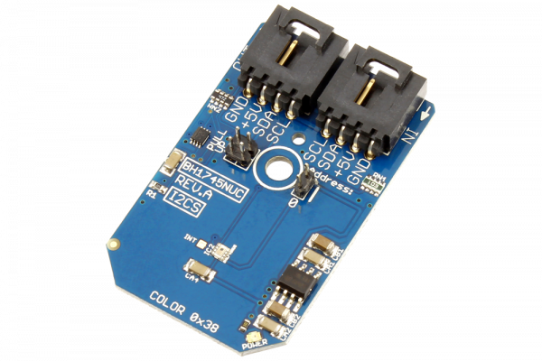

[](https://store.ncd.io/product/bh1745nuc-digital-ambient-light-and-color-sensor-i2c-mini-module/).

# BH1745NUC

ROHM Semiconductor’s BH1745NUC is a 16-bit I2C digital color sensor that detects RGB (Red, Green, Blue) components and converts them into digital values. High sensitivity, wide detection range (0.005 to 40k lx), and excellent IR cut characteristics make it easy to accurately obtain the color temperature and brightness of ambient light.This Device is available from www.ncd.io
This Device is available from www.ncd.io

[SKU: BH1745NUC]

(https://store.ncd.io/product/bh1745nuc-digital-ambient-light-and-color-sensor-i2c-mini-module/)
This Sample code can be used with Raspberry Pi.

Hardware needed to interface BH1745NUC ambient light and color sensor With Raspberry Pi :

1. <a href="https://store.ncd.io/product/bh1745nuc-digital-ambient-light-and-color-sensor-i2c-mini-module/">BH1745NUC digital ambient light and color Sensor</a>

2. <a href="https://store.ncd.io/product/i2c-shield-for-raspberry-pi-3-pi2-with-outward-facing-i2c-port-terminates-over-hdmi-port/">Raspberry Pi I2C Shield</a>

3. <a href="https://store.ncd.io/product/i%C2%B2c-cable/">I2C Cable</a>

## Python

Download and install smbus library on Raspberry pi. Steps to install smbus are provided at:

https://pypi.python.org/pypi/smbus-cffi/0.5.1

Download (or git pull) the code in pi. Run the program.

```cpp
$> python BH1745NUC.py
```
The lib is a sample library, you will need to calibrate the sensor according to your application requirement.
